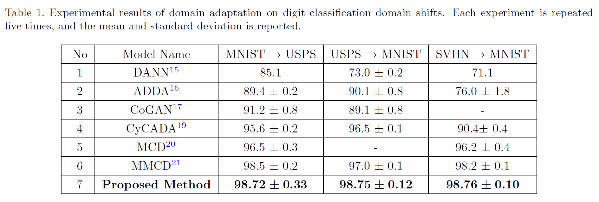

# <p align="center">Unsupervised domain adaptation using feature aligned maximum classifier discrepancy (FAMCD)</p>

<p align="center">
  <a href="https://doi.org/10.1117/12.2646422"></a>
  <a href="LICENSE"></a>
</p>

The code implementation of our SPIE 2022 paper "**Unsupervised domain adaptation using feature aligned maximum classifier discrepancy**", by [Prasanna Reddy Pulakurthi](https://www.prasannapulakurthi.com/), [Sohail A. Dianat](https://www.rit.edu/directory/sadeee-sohail-dianat), [Majid Rabbani](https://www.rit.edu/directory/mxreee-majid-rabbani), [Suya You](https://scholar.google.com/citations?user=LkpA-L0AAAAJ&hl=en), and [Raghuveer M. Rao](https://ieeexplore.ieee.org/author/37281258600). [[PDF]](https://doi.org/10.1117/12.2646422)


## Datasets
### Digits Datasets
1. MNIST
2. USPS
3. SVHN


## Results
### Digits Datasets
<p align="center"></p>


## Citation
Please consider citing our paper in your publications if it helps your research. The following is a BibTeX reference.
```bibtex
@inproceedings{10.1117/12.2646422,
author = {Prasanna Reddy Pulakurthi and Sohail A. Dianat and Majid Rabbani and Suya You and Raghuveer M. Rao},
title = {{Unsupervised domain adaptation using feature aligned maximum classifier discrepancy}},
volume = {12227},
booktitle = {Applications of Machine Learning 2022},
editor = {Michael E. Zelinski and Tarek M. Taha and Jonathan Howe},
organization = {International Society for Optics and Photonics},
publisher = {SPIE},
pages = {1222707},
keywords = {Unsupervised Domain Adaptation, Adversarial Training, Multi-Classifier Structure, Maximum Classifier Discrepancy, Maximum Entropy},
year = {2022},
doi = {10.1117/12.2646422},
URL = {https://doi.org/10.1117/12.2646422}
}
```
